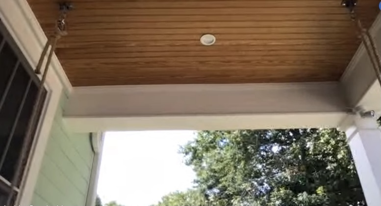
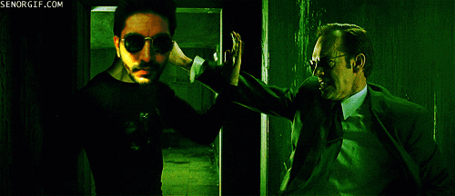
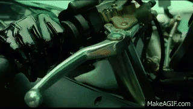
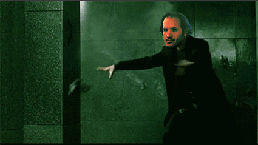
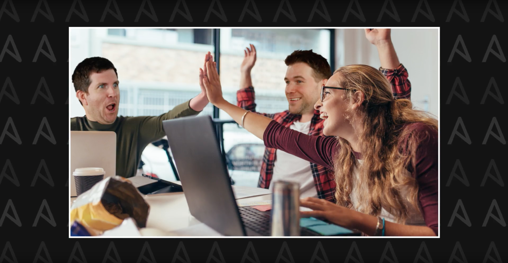
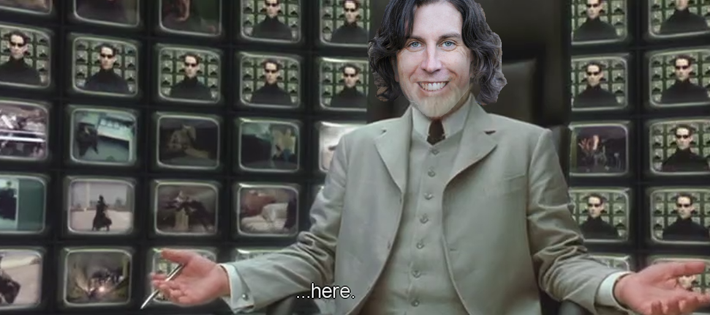

 

# Ansible team meeting backgrounds
### All your favorite offices and memes

<table>
  <tr>
    <th>Name</th>
    <th>Preview</th>
  </tr>
    <tr>
    <td>andrius_durham.png</td>
    <td></td>
  </tr>
    <tr>
    <td>andrius_porch.jpeg</td>
    <td></td>
  </tr>
    <tr>
    <td>andrius_pulp.png</td>
    <td></td>
  </tr>
    <tr>
    <td>anshul.gif</td>
    <td></td>
  </tr>
    <tr>
    <td>brain_craig.gif</td>
    <td></td>
  </tr>
    <tr>
    <td>classic_tom_anderson.png</td>
    <td></td>
  </tr>
    <tr>
    <td>colin-burritobutton.gif</td>
    <td></td>
  </tr>
    <tr>
    <td>colin-itssosimple.gif</td>
    <td></td>
  </tr>
    <tr>
    <td>colin-mindblown.gif</td>
    <td></td>
  </tr>
    <tr>
    <td>colin-ohyeahsure.gif</td>
    <td></td>
  </tr>
    <tr>
    <td>colin-pushsean.gif</td>
    <td></td>
  </tr>
    <tr>
    <td>colin-sean-timer.gif</td>
    <td></td>
  </tr>
    <tr>
    <td>colin-technically.gif</td>
    <td></td>
  </tr>
    <tr>
    <td>colin-tellmemore.gif</td>
    <td></td>
  </tr>
    <tr>
    <td>colin-thatshilarious.gif</td>
    <td></td>
  </tr>
    <tr>
    <td>colin-thinkbigger.gif</td>
    <td></td>
  </tr>
    <tr>
    <td>colin-winwin.gif</td>
    <td></td>
  </tr>
    <tr>
    <td>colin_musk.gif</td>
    <td></td>
  </tr>
    <tr>
    <td>craig-frustrated.gif</td>
    <td></td>
  </tr>
    <tr>
    <td>craig.gif</td>
    <td></td>
  </tr>
    <tr>
    <td>craig_brandt_office.jpg</td>
    <td></td>
  </tr>
    <tr>
    <td>craigometer.png</td>
    <td></td>
  </tr>
    <tr>
    <td>dafne.gif</td>
    <td></td>
  </tr>
    <tr>
    <td>jamie_tiger.png</td>
    <td></td>
  </tr>
    <tr>
    <td>marc.jpg</td>
    <td></td>
  </tr>
    <tr>
    <td>massimo.png</td>
    <td></td>
  </tr>
    <tr>
    <td>moez_fan_club.png</td>
    <td></td>
  </tr>
    <tr>
    <td>nuno.gif</td>
    <td></td>
  </tr>
    <tr>
    <td>nuno.png</td>
    <td></td>
  </tr>
    <tr>
    <td>nuno_hippo.png</td>
    <td></td>
  </tr>
    <tr>
    <td>roger-heyhey.gif</td>
    <td></td>
  </tr>
    <tr>
    <td>roger2.gif</td>
    <td></td>
  </tr>
    <tr>
    <td>sean-bananaphone.gif</td>
    <td></td>
  </tr>
    <tr>
    <td>sean-ooogoodie.gif</td>
    <td></td>
  </tr>
    <tr>
    <td>sean-robot.gif</td>
    <td></td>
  </tr>
    <tr>
    <td>sean-wtflip.gif</td>
    <td></td>
  </tr>
    <tr>
    <td>sean_architect.gif</td>
    <td></td>
  </tr>
    <tr>
    <td>sean_business_time.png</td>
    <td></td>
  </tr>
    <tr>
    <td>sean_colin_celebrate.png</td>
    <td></td>
  </tr>
    <tr>
    <td>sean_easy_livin.png</td>
    <td></td>
  </tr>
    <tr>
    <td>sean_hammer.png</td>
    <td></td>
  </tr>
    <tr>
    <td>sean_meme_architect.png</td>
    <td></td>
  </tr>
  </table>

 

*This was automatically generated using github actions and ansible!*
