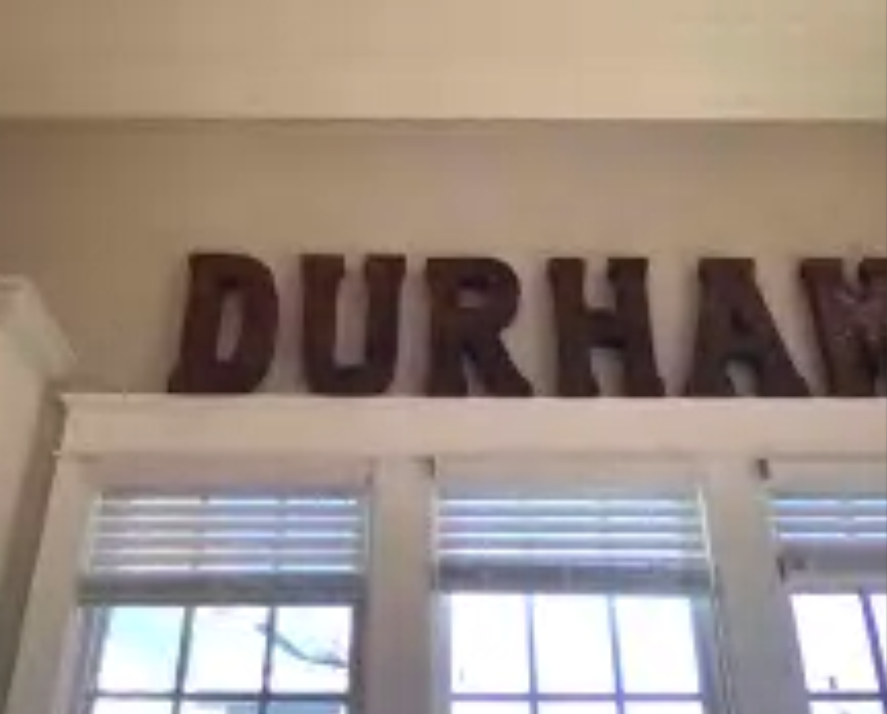

 

# Ansible team meeting backgrounds
### All your favorite offices and memes

<table>
  <tr>
    <th>Name</th>
    <th>Preview</th>
  </tr>
    <tr>
    <td>andrius.png</td>
    <td></td>
  </tr>
    <tr>
    <td>andrius_pulp.png</td>
    <td></td>
  </tr>
    <tr>
    <td>classic_tom_anderson.png</td>
    <td></td>
  </tr>
    <tr>
    <td>craigometer.png</td>
    <td></td>
  </tr>
    <tr>
    <td>jamie_tiger.png</td>
    <td></td>
  </tr>
    <tr>
    <td>marc.jpg</td>
    <td></td>
  </tr>
    <tr>
    <td>massimo.png</td>
    <td></td>
  </tr>
    <tr>
    <td>moez_fan_club.png</td>
    <td></td>
  </tr>
  </table>

 

*This was automatically generated using github actions and ansible!*
